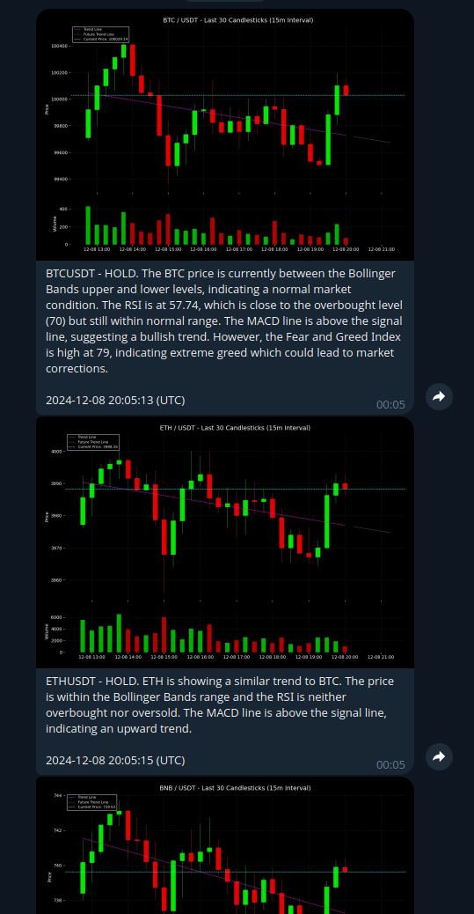

# Crypto Trend Analysis Project

## Overview

This project is designed to monitor cryptocurrency data from various sources such as Binance, CoinGecko, and Senticrypt. It calculates technical indicators and uses the OpenAI API to generate detailed analyses. These analyses are then sent to a Telegram channel for real-time updates.

## Features

- Fetch live data from multiple cryptocurrency sources.
- Calculate technical indicators for better market insights.
- Leverage AI-powered analysis using OpenAI API.
- Send automated reports and alerts to Telegram channels.
- Save analysis data to SQLite database
- Check out the Telegram showcase app to see how it works from the user's perspective:
   [@Alerts_123bot](https://t.me/Alerts_123bot)

## Screenshot



## Project Structure

- **Data Fetching**: Collects data from APIs like Binance, CoinGecko, and Senticrypt.
- **Technical Analysis**: Computes indicators such as RSI, MACD, and Bollinger Bands.
- **AI Integration**: Utilizes OpenAI for advanced market sentiment analysis.
- **Telegram Integration**: Sends updates, alerts, and detailed analysis to a specified Telegram channel.

## Prerequisites

- **Python**: Version 3.8 or higher.
- **pip**: Python package manager.
- **Virtual Environment**: Recommended for managing dependencies.
- **API Keys**: Required for:
  - Binance API
  - CoinGecko API
  - Senticrypt API
  - OpenAI API
  - Telegram Bot API

## Installation

1. Clone the repository:
   ```bash
   git clone https://github.com/FreakyLime/crypto-trend-analysis
   ```

2. Navigate to the project directory:
   ```bash
   cd crypto-trend-analysis
   ```

3. Create a virtual environment and activate it:
   ```bash
   python -m venv env
   source env/bin/activate  # On Windows: env\Scripts\activate
   ```

4. Install dependencies:
   ```bash
   pip install -r requirements.txt
   ```

5. Set up environment variables by creating a `.env` file:
   ```env
   BINANCE_API_KEY=your_binance_api_key
   TELEGRAM_BOT_TOKEN=your_telegram_bot_token
   TELEGRAM_CHAT_ID=your_telegram_chat_id
   OPENAI_API_KEY=your_openai_api_key
   ```

6. Run the database migration script to set up the SQLite database:
   ```migration
   python database/migrate.py
   ```

## Usage

1. Run the monitoring service:
   ```bash
   python main.py
   ```

2. View real-time data and updates in your Telegram channel.

## Future Enhancements

- Add Docker support for containerization.
- Add support for additional cryptocurrencies and exchanges.
- Include advanced visualizations and dashboards.
- Implement predictive models for price forecasting.

## Contributing

Contributions are welcome! Please fork the repository and submit a pull request.

## License

This project is licensed under the MIT License. See the LICENSE file for details.
